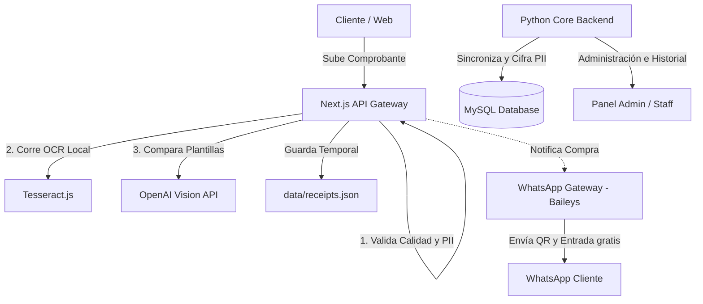

# NENEZ Web — Plataforma de Venta de Entradas y Accesos VIP

NENEZ Web es una aplicación web moderna, de alta gama y lista para producción, diseñada para la venta de entradas, gestión de accesos VIP, validación segura de tickets en eventos masivos y verificación automatizada de transferencias/depósitos bancarios. Ofrece una interfaz de usuario inmersiva con animaciones de nivel cinematográfico y una arquitectura híbrida robusta y escalable.

---

## 🚀 Características Principales

*   **Validación Inteligente de Pagos (OCR + IA):** Sistema automatizado que procesa capturas de transferencias y fotos de depósitos físicos de Ecuador (Banco Pichincha, Banco de Loja, Deuna, etc.). Combina **OCR Local (Tesseract.js)** con **OpenAI Vision API** para verificar montos, fechas, bancos y códigos de control, protegiendo al sistema contra comprobantes falsos y duplicados.
*   **Arquitectura de Plantillas de Referencia (Entrenamiento Activo):** La IA visual compara dinámicamente las imágenes cargadas por los usuarios con comprobantes reales de referencia (como papeletas de depósito físico y capturas de apps bancarias) para una precisión óptima en la clasificación de imágenes.
*   **Generador y Envío Automático de Tickets:** Creación de entradas en tiempo real con diseño personalizado, número de serie único y código QR dinámico. Envío automático de archivos PDF y QR adjuntos directamente por **Gmail** (Google OAuth2 API) y **WhatsApp**.
*   **WhatsApp Gateway Integrado:** Microservicio autónomo basado en el protocolo gratuito **Baileys (WhatsApp Web)** para enviar entradas directamente al celular del cliente sin costos de API oficiales de Meta.
*   **Panel de Administración VIP:** Panel privado para administradores que permite generar pases VIP manuales individuales o múltiples (hasta 50 en un solo clic), gestionar comprobantes recibidos y despacharlos al instante.
*   **Control y Validación de Accesos (Staff Scanner):** Interfaz móvil ultrarrápida para el personal del evento. Permite escanear códigos QR en tiempo real para validación instantánea (primer escaneo: acceso permitido; escaneos posteriores: acceso denegado).
*   **Experiencia Visual Inmersiva (Monochrome High-End):** Estética de diseño moderna con animaciones y transiciones de alto impacto visual utilizando **Framer Motion** y **GSAP (GreenSock)**.

---

## 🛠️ Stack Tecnológico

*   **Frontend & API Gateway:** Next.js 16 (App Router) + React 19 (TypeScript)
*   **Backend Core:** Python 3.11 (FastAPI + SQLModel + Alembic + MySQL)
*   **Mensajería & Notificaciones:** Node.js + Baileys (WhatsApp Web API gateway)
*   **Estilos y Transiciones:** TailwindCSS, Framer Motion y GSAP (GreenSock)
*   **Base de Datos:** PostgreSQL (para Next.js en AWS/RDS) + MySQL (para Python Core) + Fallback Local JSON
*   **Motor OCR:** Tesseract.js (Local) + OpenAI Vision API (Cloud)
*   **Seguridad:** Cloudflare Turnstile, bcryptjs, Web Crypto API y cifrado AES-256

---

## 📐 Arquitectura del Sistema

El proyecto sigue una estructura limpia, desacoplada y orientada a la mantenibilidad y escalabilidad en producción:



### 1. Ingesta y Pre-Análisis (Next.js - TypeScript)
El flujo de carga de comprobantes se procesa inicialmente en Next.js (`/api/access-drop/upload`). Aquí se aplican filtros de calidad de imagen, se extraen metadatos financieros con el OCR local, y se consulta a la IA de OpenAI usando las plantillas de referencia para verificar la autenticidad. Los datos se persisten temporalmente en un almacenamiento local JSON en desarrollo o en una base de datos PostgreSQL de alta disponibilidad en producción.

### 2. Procesamiento y Persistencia (Python Core Backend)
El backend asíncrono en Python (`backend/`) se encarga de la migración definitiva de datos mediante SQLModel y Alembic hacia una base de datos MySQL relacional. También se ocupa de la desencripción segura de datos sensibles cifrados (PII como teléfonos o correos) y del procesamiento transaccional ACID cuando un administrador aprueba manualmente un ticket.

### 3. Puerta de Enlace de WhatsApp
Un microservicio independiente en Node.js (`services/whatsapp-gateway`) conecta la sesión de WhatsApp Web mediante un código QR. Envía pases en tiempo real de forma gratuita y automatizada sin depender de la API de pago de Meta.

---

## 📁 Estructura del Proyecto

*   `🎨 /frontend`: Componentes de UI reutilizables, hooks de control de estado, animaciones de GSAP y vistas del cliente.
*   `⚡ /app`: Rutas del Next.js App Router (Administración, Staff y endpoints API).
*   `🐍 /backend`: Servidor de producción en Python (FastAPI, repositorio de datos, Alembic, controladores y modelos).
*   `📞 /services/whatsapp-gateway`: Servidor Node.js para el canal de notificaciones y envío de pases por WhatsApp.
*   `💼 /lib`: Lógica de validación, cifrado de datos de usuario, y generación de imágenes/PDF de entradas.
*   `📂 /data`: Carpeta de almacenamiento fallback para desarrollo local (archivos JSON).

---

## 🔧 Configuración y Ejecución Local

### 1. Requisitos Previos
*   Node.js (versión 20 o superior).
*   Python 3.11 y Docker / Docker-Compose (para iniciar el stack de backend).

### 2. Iniciar el Backend Completo (Docker)
Para levantar la base de datos MySQL, el servidor de caché Redis, el Core Backend de Python (FastAPI) y la pasarela de WhatsApp en contenedores:
```bash
docker-compose up --build -d
```
El backend de Python estará disponible en [http://localhost:8000](http://localhost:8000) (documentación interactiva de la API en `/docs`).

### 3. Iniciar el Frontend de Next.js
1. Copia el archivo `.env.example` en la raíz del proyecto y renombralo a `.env.local`.
2. Instala las dependencias de Node.js:
   ```bash
   npm install
   ```
3. Inicia el servidor de desarrollo:
   ```bash
   npm run dev
   ```
4. Abre [http://localhost:3000](http://localhost:3000) en tu navegador.
